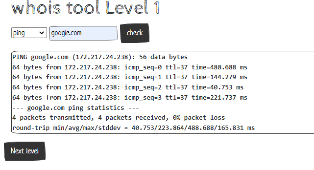
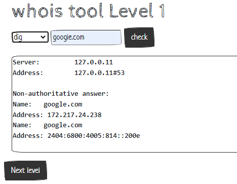
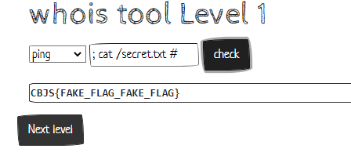

# Command Injection Level 1

## __1. Sử dụng như người dùng:__
- Giao diện ứng dụng:


Với chức năng `nslookup`, `ping`, `dig` để dò tìm địa chỉ IP
- __ping__:  
  
- __nslookup__:  

- __dig__:  


## __2. Xem đằng sau chương trình:__
Đoạn code của chương trình:
```php
<?php
    if(isset($_POST['command'],$_POST['target'])){
        $command = $_POST['command'];
        $target = $_POST['target'];
		switch($command) {
			case "ping":
				$result = shell_exec("timeout 10 ping -c 4 $target 2>&1");
				break;
			case "nslookup":
				$result = shell_exec("timeout 10 nslookup $target 2>&1");
				break;	
			case "dig":
				$result = shell_exec("timeout 10 dig $target 2>&1");
				break;
		}
		die($result);
    }
?>
```
Luồng chạy đoạn code:  
Nếu `command` và `target` được set trong cú `$_POST` thì:
- Nếu `command` là `ping` thì chạy hàm `shell_exec()` với tham số là chuỗi ping đến `target`.
- Nếu `command` là `nslookup` thì chạy hàm `shell_exec()` với tham số là chuỗi nslookup đến `target`.
- Nếu `command` là `dig` thì chạy hàm `shell_exec()` với tham số là chuỗi dig đến `target`.

## __3. Lên ý tưởng và Khai thác:__
### a. Ý tưởng:
Vì `target` đưa vào không được kiểm tra và giới hạn gì cả nên có thể chạy các đoạn `command` ngoài chương trình.  

_Untrusted Data:_
- `target`: Nơi này người dùng có thể điền vào 1 cách thoải mái.

Nhưng ở trong hàm `shell_exec()` chỉ được chạy command trên 1 dòng nên mình sẽ đi search làm sao để có thể chạy nhiều command trên 1 dòng.  
Vậy mình tìm được các ký tự để chạy nhiều command như:
- `&` &rarr; Chạy command ở 2 vế ký tự và các command được chạy tuần tự.
- `&&` &rarr; Chạy command ở 2 vế ký tự, command vế trái chạy đúng thì command vế phải mới được chạy.
- `|` &rarr; Chạy command ở 2 vế ký tự và `output` của command vế trái là `input` của command vế phải.
- `||` &rarr; Chạy command ở 2 vế ký tự và ký tự này như `or` 1 trong 2 hoặc cả 2 command đều chạy.
- `;` &rarr; Chạy các command 1 cách riêng biệt không phụ thuộc vào nhau. 

Có vẻ mình dùng `;` thuận tiện hơn.

### b. Khai thác:
Ở `target` mình nhập vào `; ls #` lúc này khi đưa vào tham số chuỗi để chạy command là (Ví dụ ở `ping`) `timeout 10 ping -c 4 ; ls # 2>&1` &rarr; dấu `;` sẽ tách lệnh `ping` và `ls` chạy riêng biệt đồng thời mình dùng `#` để command các phần thừa phía sau tránh trường hợp chạy không hợp lệ.

Đưa payload lên Server thôi:  


Vậy mình RCE được Server rồi bây giờ mình lấy flag thôi.  

List tất cả các file/dir ở `root` và phát hiện có file `secret.txt`.  


Lấy flag.  


> CBJS{FAKE_FLAG_FAKE_FLAG}