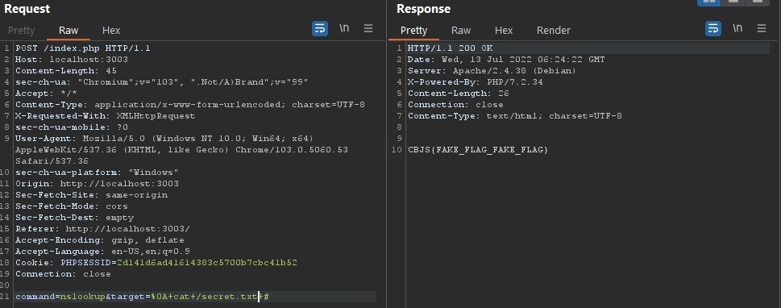

# Command Injection Level 3

## __1. Sử dụng như người dùng:__
Giao diện như ở các Level trước. 

Dùng Payload ở Lv2 thì chắc chắn không được.


## __2. Xem đằng sau chương trình:__
Đoạn code mới:
```php
<?php
    if(isset($_POST['command'],$_POST['target'])){
        $command = $_POST['command'];
        $target = $_POST['target'];
        if (strpos($target, ";") !== false) 
            die("Hacker detected!");
        if (strpos($target, "&") !== false) 
            die("Hacker detected!");
        if (strpos($target, "|") !== false) 
            die("Hacker detected!");
		switch($command) {
			case "ping":
				$result = shell_exec("timeout 10 ping -c 4 $target &2 > 1");
				break;
			case "nslookup":
				$result = shell_exec("timeout 10 nslookup $target &2 > 1");
				break;	
			case "dig":
				$result = shell_exec("timeout 10 dig $target &2 > 1");
				break;
		}
		die($result);
    }
?>
```
Lúc này anh Dev đã biết các cách để chạy multiple command trên 1 dòng rồi nên anh ấy đã chặn hết những ký tự mình đề cập ở lv1. Và luồng chạy code vẫn như cũ chỉ thêm Filter.

## __3. Lên ý tưởng và Khai thác:__
### a. Ý tưởng:
Vậy chặn hết ký tự ngăn cách các command trên một dòng rồi thì liệu có cách nào ngắt dòng và tạo dòng mới chạy command không?  
Sau khi mình search Google tìm ra ký tự `%0A` để tạo dòng mới nhưng đây là ký tự encode URL khi chạy trên URL thì sẽ được decode và ra ký tự xuống dòng trong `target`.

### b. Khai thác:
Cũng như ở 2 lv trước để payload `%0A ls #` vào `target` và xem kết quả `Response`:  


Vậy mình đã RCE được Server và lấy `flag` thôi.  

> CBJS{FAKE_FLAG_FAKE_FLAG}