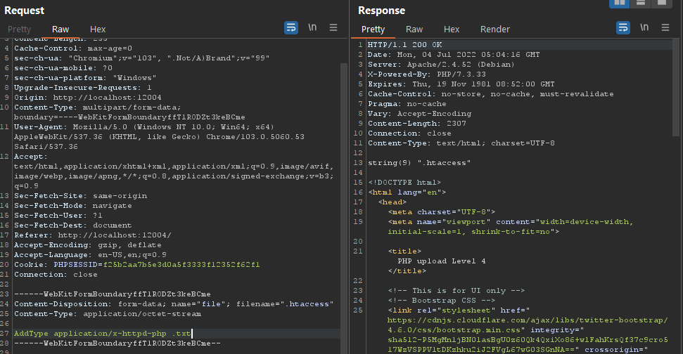
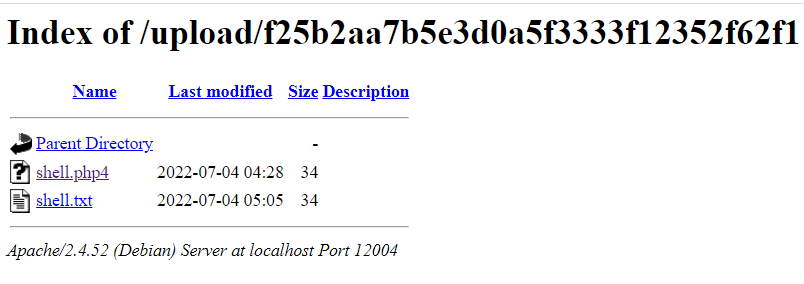

# File Upload Level 4

## __1. Sử dụng như người dùng__
Vẫn là các giao diện ở level trước và mình vẫn upload các file như ở Level 3 và đương nhiên sẽ bị `Hack detected`.

## __2. Khám phá bên trong ứng dụng__
__1. File `index.php`:__
```php
<?php
    // error_reporting(0);

    // Create folder for each user
    session_start();
    if (!isset($_SESSION['dir'])) {
        $_SESSION['dir'] = 'upload/' . session_id();
    }
    $dir = $_SESSION['dir'];
    if ( !file_exists($dir) )
        mkdir($dir);

    if(isset($_GET["debug"])) die(highlight_file(__FILE__));
    if(isset($_FILES["file"])) {
        $error = '';
        $success = '';
        try {
            $filename = $_FILES["file"]["name"];
            var_dump($filename);
            $extension = end(explode(".", $filename));
            if (in_array($extension, ["php", "phtml", "phar"])) {
                die("Hack detected");
            }
            $file = $dir . "/" . $filename;
            move_uploaded_file($_FILES["file"]["tmp_name"], $file);
            $success = 'Successfully uploaded file at: <a href="/' . $file . '">/' . $file . ' </a><br>';
            $success .= 'View all uploaded file at: <a href="/' . $dir . '">/' . $dir . ' </a>';
        } catch(Exception $e) {
            $error = $e->getMessage();
        }
    }
?>
```
À vây anh Dev đã chăn tất cả các extension _php_, _phtml_, _phar_.  
Như mình cũng đã search ở Lv3 thì còn có các đuôi file khác như _php3_, _php4_,... và mình cũng upload file với đuôi là _php4_ nhưng chẳng có tác dụng và httpd hành xử như 1 file bình thường  
  

_Vị trí Untrusted Data:_
* `$_FILES`

__2. File `.htaccess`:__ Không thay đổi  

__3. File `docker-php.conf`:__ Không thay đổi

__4. File `apche2.conf`:__ Đây là 1 file mới được thêm vào nhằm cấu hình thêm cho server Apache  
```apache
# This is the main Apache server configuration file.

DefaultRuntimeDir ${APACHE_RUN_DIR}

PidFile ${APACHE_PID_FILE}

Timeout 300
KeepAlive On
MaxKeepAliveRequests 100
KeepAliveTimeout 5

User ${APACHE_RUN_USER}
Group ${APACHE_RUN_GROUP}

HostnameLookups Off

# Include module configuration:
IncludeOptional mods-enabled/*.load
IncludeOptional mods-enabled/*.conf

# Include list of ports to listen on
Include ports.conf

<Directory />
        Options FollowSymLinks
        AllowOverride None
        Require all denied
</Directory>

<Directory /usr/share>
        AllowOverride None
        Require all granted
</Directory>

<Directory /var/www/>
        Options Indexes FollowSymLinks
        # CHANGELOG: Added to allow .htaccess
        AllowOverride All
        Require all granted
</Directory>

# CHANGELOG: Added to allow .htaccess
AccessFileName .htaccess

#
# The following lines prevent .htaccess and .htpasswd files from being
# viewed by Web clients.
#
<FilesMatch "^\.ht">
        Require all denied
</FilesMatch>


#
# The following directives define some format nicknames for use with
# a CustomLog directive.
ErrorLog ${APACHE_LOG_DIR}/error.log
LogLevel warn

LogFormat "%v:%p %h %l %u %t \"%r\" %>s %O \"%{Referer}i\" \"%{User-Agent}i\"" vhost_combined
LogFormat "%h %l %u %t \"%r\" %>s %O \"%{Referer}i\" \"%{User-Agent}i\"" combined
LogFormat "%h %l %u %t \"%r\" %>s %O" common
LogFormat "%{Referer}i -> %U" referer
LogFormat "%{User-agent}i" agent

# Include generic snippets of statements
IncludeOptional conf-enabled/*.conf

# Include the virtual host configurations:
IncludeOptional sites-enabled/*.conf
```
Đọc qua sơ hết phần cấu hình cho Apache thì mình có chú ý 1 chỗ  
  
Á à trong thư mục /var/www/ cho phép file `.htaccess` được hoạt đông  
Vây mình sẽ tìm hiểu về cách hoạt động của file `.htaccess` (tìm hiểu sau)

## __3. Khai thác__
Mình biết được cấu hình file `.htacess` làm cho server thực thi các file với extension khác vẫn có thể chạy như file PHP  
Upload file `.htaccess` với content là
```apache
AddType application/x-httpd-php .txt
```
sẽ cho phép chạy _.txt_ như code PHP

  
Upload file `shell.txt` lên
  
Trên thư mục người dùng đã có file txt
  
Chạy thử file `shell.txt` để RCE


___Flag:___
>CBJS{FAKE_FLAG_FAKE_FLAG}