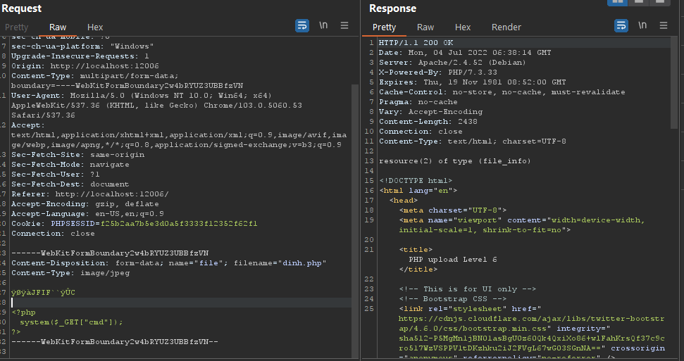
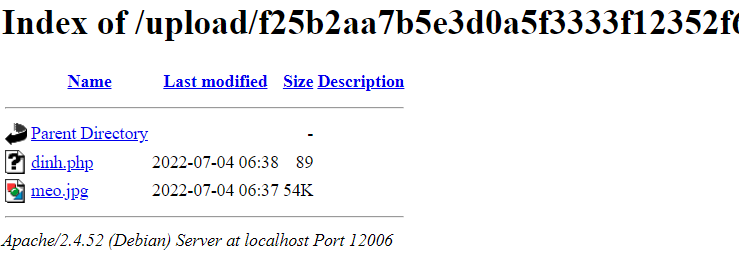

# File Upload Level 5

## __1. Sử dụng như người dùng__

Có vẻ như anh Dev đã fix lại lỗi ở Lv5 rồi. Mình thử upload như Lv5 và đây là kết quả  
  
Bị kick không thương xót

## __2. Khám phá bên trong ứng dụng__
__1. File `index.php`:__
```php
<?php

    // Create folder for each user
    session_start();
    $dir = 'upload/' . session_id();
    if ( !file_exists($dir) )
        mkdir($dir);

    $error = '';
    $success = '';
    if(isset($_GET["debug"])) die(highlight_file(__FILE__));
    if(isset($_FILES["file"])) {
        try {
            $finfo = finfo_open(FILEINFO_MIME_TYPE);
            var_dump($finfo);
            $mime_type = finfo_file($finfo, $_FILES['file']['tmp_name']);
            $whitelist = array("image/jpeg", "image/png", "image/gif");
            if (!in_array($mime_type, $whitelist, TRUE)) {
                die("Hack detected");
            }
            $file = $dir . "/" . $_FILES["file"]["name"];
            move_uploaded_file($_FILES["file"]["tmp_name"], $file);
            $success = 'Successfully uploaded file at: <a href="/' . $file . '">/' . $file . ' </a><br>';
            $success .= 'View all uploaded file at: <a href="/' . $dir . '">/' . $dir . ' </a>';
        } catch(Exception $e) {
            $error = $e->getMessage();
        }
    }
?>
```
- Các loại file khác nhau sẽ được xác định bằng một vài byte đầu tiên của file, gọi là __file signature__ (chữ kí đầu tệp).  
- Trên đoạn code có sử dụng hàm `finfo_file()` sẽ so sánh chữ ký đầu tệp của các file trong magic database để đưa ra kết luận tập tin là gì.
- Magic database là nơi chứa tất cả chữ ký đầu tệp của các file tương ứng.
- Server chỉ lấy file signature bằng `finfo_file` và kiểm tra với _whitelist_ (`"image/jpeg"`, `"image/png"`, `"image/gif"`).

__2. File `.htaccess`:__ Không thay đổi  

__3. File `docker-php.conf`:__ Không thay đổi

## __3. Khai thác__
Vậy ở trong code của Server sẽ kiểm tra chữ ký đầu tệp. Vậy nếu file PHP có chữ ký đầu tệp của file jpeg thì sao nhỉ?  

Mình dùng BurpSuite để tiện cho việc này  
  
Vậy mình đã upload file PHP với "đầu" file JPEG để lừa Server thành công.

Xem trong thư mục người dùng đã có file php vừa up
  
RCE Server  


___Flag:___
>CBJS{FAKE_FLAG_FAKE_FLAG}